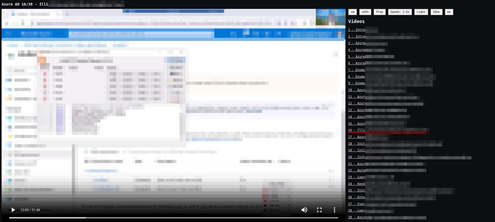

# A Video Player for AlteredSecurity Courses
I quickly made this to track my progression throughout the videos provided by AlteredSecurity. It works by using [local browser storage](https://developer.mozilla.org/en-US/docs/Web/API/Window/localStorage). 

The HTML and JS will:
+ Be like a regular video player with
	+ play/pause
	+ previous/next
	+ 10s back/forward
	+ speed adjustments
	+ light/dark mode
+ Remember your settings
	+ the last video you were viewing
	+ the timestamp and playback speed
	+ light/dark mode



## Usage
Install the dependencies (just `jinja2`) and then generate the HTML with `generate.py`. Afterward open the HTML in your preferred browser and add it as a bookmark. 

```
usage: generate.py [-h] -t TITLE -d DIR [-o OUTFILE] [-e EXTENSION]

options:
  -h, --help            show this help message and exit
  -t TITLE, --title TITLE
                        Course Title
  -d DIR, --dir DIR     Directory containing the videos
  -o OUTFILE, --outfile OUTFILE
                        Output HTML file
  -e EXTENSION, --extension EXTENSION
                        Video file extension
```

Example:
```bash
pip install -r requirements.txt

python generate.py -t "Azure AD" -d ~/edu/azureadlab/CourseVideos -o ~/edu/azureadlab/CourseVideos/index.html
```